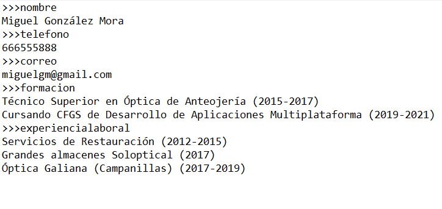
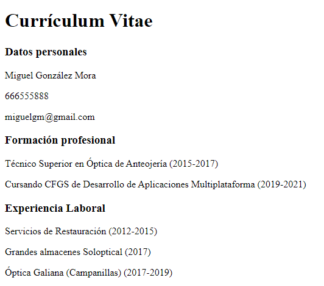

# Generar_CV
Programa en Java que genera un curriculum en html a través de un fichero de texto .txt. En el caso de que no encuentre el fichero o tenga problemas de lectura/escritura, reportará un error.

Imagen del fichero .txt.

Imagen del html generado a través del programa.
